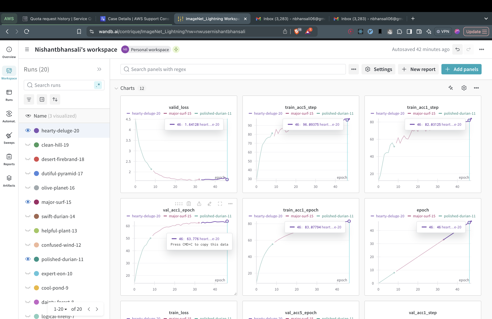

# Imagenet training

## Logs

- 
```
TPU available: False, using: 0 TPU cores
Sun Dec 29 17:58:42 2024
+-----------------------------------------------------------------------------------------+
HPU available: False, using: 0 HPUs
| NVIDIA-SMI 550.127.05             Driver Version: 550.127.05     CUDA Version: 12.4     |
|-----------------------------------------+------------------------+----------------------+
HPU available: False, using: 0 HPUs
| GPU  Name                 Persistence-M | Bus-Id          Disp.A | Volatile Uncorr. ECC |
| Fan  Temp   Perf          Pwr:Usage/Cap |           Memory-Usage | GPU-Util  Compute M. |
/opt/conda/envs/pytorch/lib/python3.11/site-packages/pytorch_lightning/trainer/connectors/logger_connector/result.py:434: It is recommended to use self.log('val_acc1', ..., sync_dist=True) when logging on epoch level in distributed setting to accumulate the metric across devices.
/opt/conda/envs/pytorch/lib/python3.11/site-packages/pytorch_lightning/trainer/connectors/logger_connector/result.py:434: It is recommended to use self.log('val_acc5', ..., sync_dist=True) when logging on epoch level in distributed setting to accumulate the metric across devices.
Epoch 0: 100%|██████████████████████████████████████████████████████████████████████████████████████████████████████████████| 1252/1252 [21:44<00:00,  0.96it/s, v_num=ovtl, train_acc1_step=8.330, val_acc1_step=18.90, val_acc1_epoch=13.80]/opt/conda/envs/pytorch/lib/python3.11/site-packages/pytorch_lightning/trainer/connectors/logger_connector/result.py:434: It is recommended to use self.log('train_acc1', ..., sync_dist=True) when logging on epoch level in distributed setting to accumulate the metric across devices.
/opt/conda/envs/pytorch/lib/python3.11/site-packages/pytorch_lightning/trainer/connectors/logger_connector/result.py:434: It is recommended to use self.log('train_acc5', ..., sync_dist=True) when logging on epoch level in distributed setting to accumulate the metric across devices.
Epoch 1:  15%|█████████████▏                                                                         | 189/1252 [03:11<17:55,  0.99it/s, v_num=ovtl, train_acc1_step=13.70, val_acc1_step=18.90, val_acc1_epoch=13.80, train_acc1_epoch=7.760]Epoch 1:  15%|█████████████▏                                                                         | 190/1252 [03:12<17:54,  0.99it/s, v_num=ovtl, train_acc1_step=19.10, val_acc1_step=18.90, val_acc1_epoch=13.80, train_acc1_epoch=7.760]Epoch 2:  47%|████████████████████████████████████████▌                                              | 583/1252 [09:46<11:13,  0.99it/s, v_num=ovtl, train_acc1_step=27.00, val_acc1_step=25.50, val_acc1_epoch=23.10, train_acc1_epoch=20.40]Epoch 4:  10%|████████▊                                                                              | 127/1252 [02:09<19:02,  0.98it/s, v_num=ovtl, train_acc1_step=43.00, val_acc1_step=36.80, val_acc1_epoch=35.50, train_acc1_epoch=37.10]Epoch 5:   1%|█▏                                                                                      | 17/1252 [00:18<22:42,  0.91it/s, v_num=ovtl, train_acc1_step=43.00, val_acc1_step=42.90, val_acc1_epoch=40.50, train_acc1_epoch=42.50]Epoch 9:   0%|                                                                                                 | 0/1252 [00:00<?, ?it/s, v_num=ovtl, train_acc1_step=44.40, val_acc1_step=51.90, val_acc1_epoch=50.10, train_acc1_epoch=55.20]Traceback (most recent call last):
File "/opt/conda/envs/pytorch/lib/python3.11/multiprocessing/queues.py", line 244, in _feed
obj = _ForkingPickler.dumps(obj)
^^^^^^^^^^^^^^^^^^^^^^^^^^
File "/opt/conda/envs/pytorch/lib/python3.11/multiprocessing/reduction.py", line 51, in dumps
cls(buf, protocol).dump(obj)
File "/opt/conda/envs/pytorch/lib/python3.11/site-packages/torch/multiprocessing/reductions.py", line 619, in reduce_storage
df = multiprocessing.reduction.DupFd(fd)
^^^^^^^^^^^^^^^^^^^^^^^^^^^^^^^^^^^
File "/opt/conda/envs/pytorch/lib/python3.11/multiprocessing/reduction.py", line 198, in DupFd
return resource_sharer.DupFd(fd)
^^^^^^^^^^^^^^^^^^^^^^^^^
File "/opt/conda/envs/pytorch/lib/python3.11/multiprocessing/resource_sharer.py", line 53, in init
self._id = _resource_sharer.register(send, close)
^^^^^^^^^^^^^^^^^^^^^^^^^^^^^^^^^^^^^^
File "/opt/conda/envs/pytorch/lib/python3.11/multiprocessing/resource_sharer.py", line 76, in register
self._start()
File "/opt/conda/envs/pytorch/lib/python3.11/multiprocessing/resource_sharer.py", line 126, in _start
self._listener = Listener(authkey=process.current_process().authkey, backlog=128)
^^^^^^^^^^^^^^^^^^^^^^^^^^^^^^^^^^^^^^^^^^^^^^^^^^^^^^^^^^^^^^^^
File "/opt/conda/envs/pytorch/lib/python3.11/multiprocessing/connection.py", line 458, in init
address = address or arbitrary_address(family)
^^^^^^^^^^^^^^^^^^^^^^^^^
File "/opt/conda/envs/pytorch/lib/python3.11/multiprocessing/connection.py", line 77, in arbitrary_address
return tempfile.mktemp(prefix='listener-', dir=util.get_temp_dir())
^^^^^^^^^^^^^^^^^^^
File "/opt/conda/envs/pytorch/lib/python3.11/multiprocessing/util.py", line 149, in get_temp_dir
tempdir = tempfile.mkdtemp(prefix='pymp-')
^^^^^^^^^^^^^^^^^^^^^^^^^^^^^^^^
File "/opt/conda/envs/pytorch/lib/python3.11/tempfile.py", line 385, in mkdtemp
_os.mkdir(file, 0o700)
OSError: [Errno 28] No space left on device: '/tmp/pymp-m_olac7h'
Epoch 9:   0%|                                                                                         | 1/1252 [00:02<58:30,  0.36it/s, v_num=ovtl, train_acc1_step=58.60, val_acc1_step=51.90, val_acc1_epoch=50.10, train_acc1_epoch=55.20][rank2]:[E1229 20:29:13.091296956 ProcessGroupNCCL.cpp:1484] [PG ID 0 PG GUID 0(default_pg) Rank 2] ProcessGroupNCCL's watchdog got stuck for 480 seconds without making progress in monitoring enqueued collectives. This typically indicates a NCCL/CUDA API (e.g., CudaEventDestroy) hang blocking the watchdog, and could be triggered by another thread holding the GIL inside a CUDA api (for example, CudaEventDestroy), or other deadlock-prone behaviors.If you suspect the watchdog is not actually stuck and a longer timeout would help, you can either increase the timeout (TORCH_NCCL_HEARTBEAT_TIMEOUT_SEC) to a larger value or disable the heartbeat monitor (TORCH_NCCL_ENABLE_MONITORING=0).If either of aforementioned helps, feel free to file an issue to PyTorch about the short timeout or false positive abort; otherwise, please attempt to debug the hang.
[rank3]:[E1229 20:29:13.156284896 ProcessGroupNCCL.cpp:1484] [PG ID 0 PG GUID 0(default_pg) Rank 3] ProcessGroupNCCL's watchdog got stuck for 480 seconds without making progress in monitoring enqueued collectives. This typically indicates a NCCL/CUDA API (e.g., CudaEventDestroy) hang blocking the watchdog, and could be triggered by another thread holding the GIL inside a CUDA api (for example, CudaEventDestroy), or other deadlock-prone behaviors.If you suspect the watchdog is not actually stuck and a longer timeout would help, you can either increase the timeout (TORCH_NCCL_HEARTBEAT_TIMEOUT_SEC) to a larger value or disable the heartbeat monitor (TORCH_NCCL_ENABLE_MONITORING=0).If either of aforementioned helps, feel free to file an issue to PyTorch about the short timeout or false positive abort; otherwise, please attempt to debug the hang.
[rank2]:[F1229 20:37:13.091528310 ProcessGroupNCCL.cpp:1306] [PG ID 0 PG GUID 0(default_pg) Rank 2] [PG ID 0 PG GUID 0(default_pg) Rank 2] Terminating the process after attempting to dump debug info, due to ProcessGroupNCCL watchdog hang.
[rank3]:[F1229 20:37:13.156485650 ProcessGroupNCCL.cpp:1306] [PG ID 0 PG GUID 0(default_pg) Rank 3] [PG ID 0 PG GUID 0(default_pg) Rank 3] Terminating the process after attempting to dump debug info, due to ProcessGroupNCCL watchdog hang.
[rank: 2] Child process with PID 13117 terminated with code -6. Forcefully terminating all other processes to avoid zombies 🧟
Killed
```

Dont have complete logs as the training logs were being updated inplace by wandb and pytorch lightning. Had to do the training in 3 runs as the spot maching was being terminated by AWS.

Can refere to video for live training in EC2